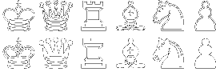
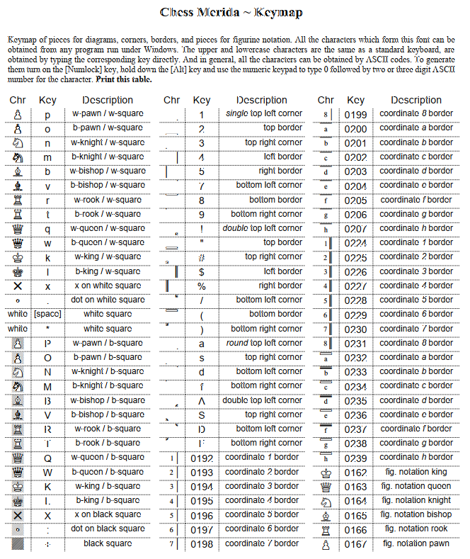
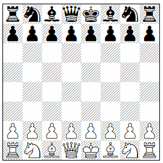

# Webfont Chess Mérida
This is a web font WOFF2 version of the
TrueType Font "Chess Mérida", created by
__Armando Hernandez Marroquin__.

You will find the original data (12-AUG-1998)
on Eric Bentzen's page [Chess Fonts](https://www.enpassant.dk/chess/fonteng.htm#MERIDA).

```
Chess Mérida
Freeware.
True Type Font by Armando H. Marroquin for 
diagrams and figurine notation.
A classic font named after the city Mérida on Yacatan.
Frame with co-ordinates possible.
```

Chess Mérida pieces:

.
 
Download [merid_tt.zip](merid_tt/merid_tt.zip) (27 KB)

## Data in this Repository

* css
  * chessmerida.css
* docs
  * ChessMerida.docx
  * ChessMerida.odt
  * ChessMerida.pdf
  * ChessMerida.rtf
  * README.txt
* fonts
  * ChessMerida.ttf
  * ChessMerida.woff2
* images
  * cc-by_88x31.png
  * ChessMerida-Keymap.png
  * ChessMerida_Pieces.png
  * initialposition.png
* merid_tt
  * merid_tt.zip 
  * CHESMERI.DOC
  * LEEME__D.TXT
  * MERIFONT.TTF
  * README_D.TXT
* samples
  * initialposition.html

## Chess Mérida Keymap

```
                White Square    Dark Square
Empty Square         [space]        +
White Pawn           p              P
Black Pawn           o              O
White Knight         n              N
Black Knight         m              M
White Bishop         b              B
Black Bishop         v              V
White Rook           r              R
Black Rook           t              T
White Queen          q              Q
Black Queen          w              W
White King           k              K
Black King           l              L
```

You will find the complete keymap in the
file [docs/ChessMerida.pdf](docs/ChessMerida.pdf),
or in the file _images/ChessMerida-Keymap.png_:



### Sample
This HTML code

```
<div class="fcm">tMvWlVmT
OoOoOoOo
 + + + +
+ + + +
 + + + +
+ + + +
pPpPpPpP
RnBqKbNr</div>
```

creates the following output in a browser



## Changes to the original Data
The original data are located in the directory
_merid_tt_.

### merid_tt/CHESMERI.DOC
I converted this file to the file 
_docs/ChessMerida.docx_ with the tool
[Convertio](https://convertio.co/).
In Word I converted this file to the files  
_docs/ChessMerida.odt_, 
_docs/ChessMerida.pdf_ (with embedded fonts)
and _docs/ChessMerida.rtf_.

### merid_tt/MERIFONT.TTF
I copied the file _merid_tt/MERIFONT.TTF_ to
_fonts/ChessMerida.ttf_. I converted this file
to the file _fonts/ChessMerida.woff2_ with the tool 
[TTF to WOFF2 Converter](https://cloudconvert.com/ttf-to-woff2).

### merid_tt/README_D.TXT
I copied the file _merrid_tt/README_D.TXT 
to _docs/Readme.txt_ and changed the 
Charset to UTF-8.

## Kudos
* Armando Hernandez Marroquin  
  for creating this font.
* This work is inspired by the GitHub repository
[vasiliyaltunin/chess-merida-font](https://github.com/vasiliyaltunin/chess-merida-font).
